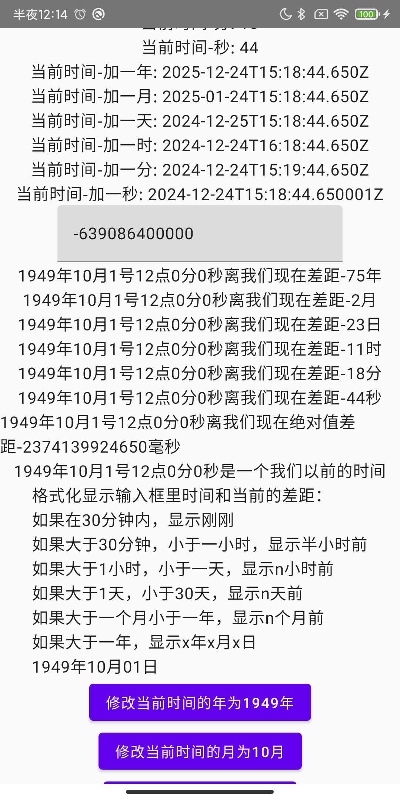

# WanKMP

这是一个针对 Android、iOS、Web 和桌面的 Kotlin 多平台项目。

在这里，我将会去学习kotlin multiplatform 项目的技术，并且尝试搭建一个自己的技术路线。

我将按照以下的目标去实现，并且每个知识点将从当前构建出来的基础分支上，切出一个新的分支，留做对比和记录.

基础分支：https://github.com/zengcanxiang/WanKMP/tree/main

## 搭建kmp环境

| 内容                   | 链接                                                                                                                                                                               |
|----------------------|----------------------------------------------------------------------------------------------------------------------------------------------------------------------------------|
| 官方指南                 | https://www.jetbrains.com/help/kotlin-multiplatform-dev/get-started.html  https://github.com/JetBrains/compose-multiplatform/#compose-multiplatform   https://kotl.in/wasm |
| 创建项目                 | https://kmp.jetbrains.com                                                                                                                                                        |
| 设置运行命令               | https://www.jetbrains.com/help/kotlin-multiplatform-dev/compose-multiplatform-create-first-app.html#run-your-application                                                         |
| github kmp simple 前排 | https://github.com/topics/kotlin-multiplatform-sample                                                                                                                            |
| touchlab kmp 博客列表    | https://www.touchlab.co/tag/kotlin-multiplatform/                                                                                                                                |
| 看到再加 ☺️              |                                                                                                                                                                                  |

### 较为细致的子文档

[kmp项目结构的介绍](https://kotlinlang.org/docs/multiplatform-discover-project.html)

## 跨平台能力

| 能力          | 文档地址                                              | 
|-------------|---------------------------------------------------|
| 如何调试各个平台    | [README_DEBUG.md](./README/debug/README_DEBUG.md) |
| 如何获取各个平台的产物 |                                                   | 

## kmp依赖

协程，flow

| 库                         | 文档地址                                                                      | 分支                                                                                                         | 截图                                                                         |
|---------------------------|---------------------------------------------------------------------------|------------------------------------------------------------------------------------------------------------|----------------------------------------------------------------------------|
| 网络-ktor                   | [README_KTOR.md](./README/ktor/README_KTOR.md)                            | [feature/dependencies/ktor](https://github.com/zengcanxiang/WanKMP/tree/feature/dependencies/ktor)         |                                                                            |
| 序列化-kotlinx-serialization | [README_SERIALIZATION.md](./README/serialization/README_SERIALIZATION.md) |                                                                                                            |                                                                            |
| 数据库-room                  |                                                                           |                                                                                                            |                                                                            |
| 时间-kotlinx-datetime       | [README_DATETIME.md](./README/datetime/README_DATETIME.md)                | [feature/dependencies/datetime](https://github.com/zengcanxiang/WanKMP/tree/feature/dependencies/datetime) |  |
| 分页加载-paging               | [README_PAGING.md](./README/paging/README_PAGING.md)                      |                                                                                                            |                                                                            |
| 键值对                       | [README_DATASTORE.md](./README/datastore/README_DATASTORE.md)             |                                                                                                            |                                                                            |
| 生命周期和viewModel            |                                                                           |                                                                                                            |                                                                            |
| 依赖注入                      |                                                                           |                                                                                                            |                                                                            |

## kmp框架

kmp框架 系统时间变化监听。可见性埋点, 混淆，资源携带 字符 图片、视频 pag

| 库      | 文档地址                                        |      
|--------|---------------------------------------------|
| lottie | https://github.com/alexzhirkevich/compottie |
| 权限申请   |                                             |
| 网络状态监听 |                                             |
| 图片加载   |                                             |
| 路由     |                                             |

### 一些重点第三方库或者开源APP

| 内容             | 链接                                                                 |
|----------------|--------------------------------------------------------------------|
| deeplink       | https://github.com/FelipeKoga/deeplink-launcher?tab=readme-ov-file |
| 网络请求           | https://github.com/Foso/Ktorfit                                    |
| 你画我猜           | https://github.com/rvenky125/DoodleKingKMM                         |
| google service |                                                                    |

## kmp运行时

安装后的文件目录，弹窗，超大图查看 ，，，

| 库                   | 文档地址 |
|---------------------|------|     
| 安装新版本               |      |
| 系统浏览器打开链接           |      |
| 操作和选择文件             |      |
| 触摸手势和鼠标、触摸板、键盘快捷键交互 |      |
| 皮肤+日夜间适配            |      |
| 多语言                 |      |
| 通知                  |      |
| deeplink            |      |
| 拍照和录像               |      |
| 保存文件（私有和公开目录）       |      |
| 系统相册                |      |
| 和原生控件相互嵌套和调用        |      |
| 富文本和emoji           |      |

## kmp动效

进度，渐变，位移，缩放，动画组，转场动画，

