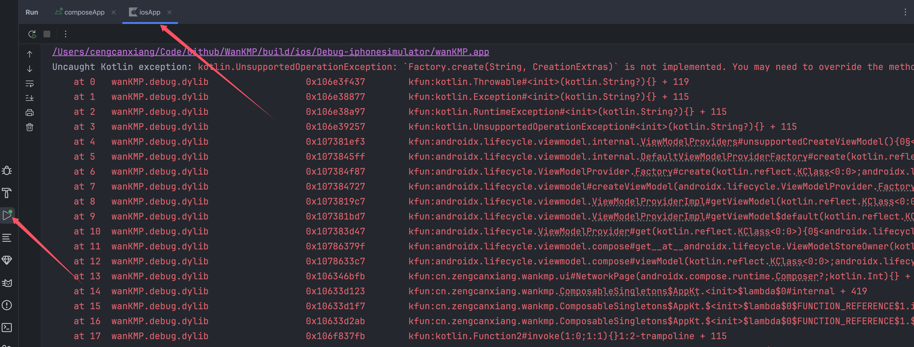
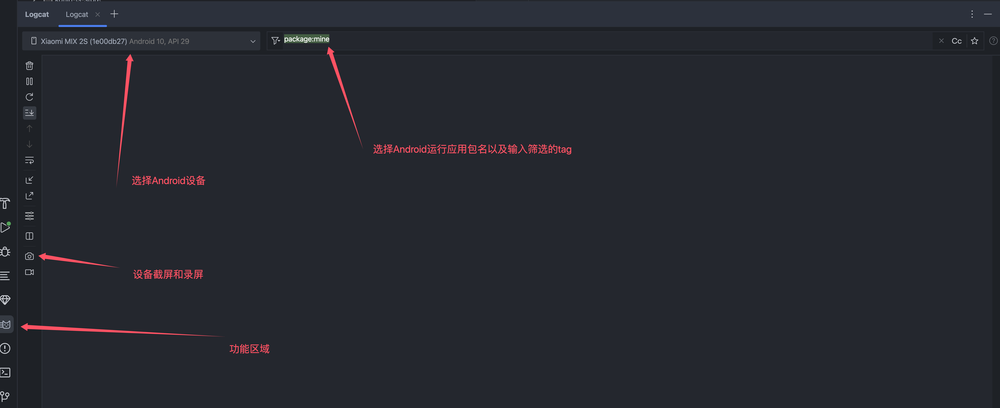
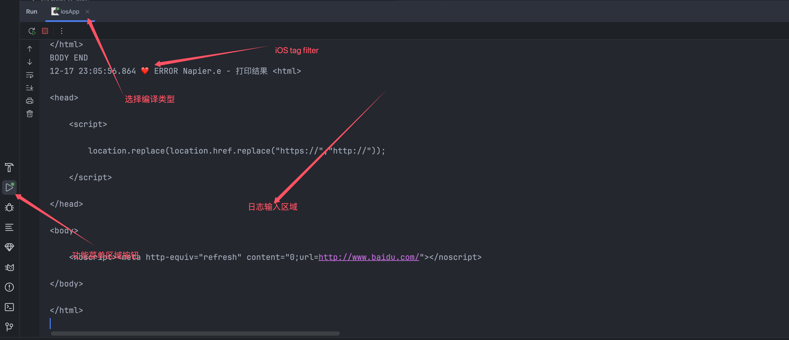
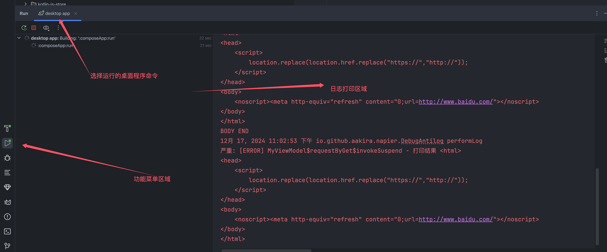

# Kotlin-MultiPlatform-Debug

在开发任何一款产品，使用任何一款语言或者框架时，都需要熟练掌握对应的开发工具IDE的调试能力和技巧,KMP也不例外.

## KMP-IDEA

现阶段，kmp使用的开发工具为：android-studio(idea) + kotlin multiplatform插件, 下一个阶段官方说是会推出集成式的fleet。

## 调试

那么对于android开发同学来说，对于kmp的调试要简单很多，与Android开发时，相差无几。

对于其他同学来说，就有一个学习idea的使用的过程，不过很简单，主要参考

下面介绍几个，个人觉得一定需要掌握的

### 断点

https://www.jetbrains.com/help/idea/debugging-code.html

### 网页调试

## 查看

### 崩溃原因

### 堆栈还原

### 日志

从下面的图可以看出，作为原生android开发的androidstudio对android的logcat还是功能最多的，对于其他的端，主要在studio内，是对终端输入的一个转接，如果想要更细致的操作，需要使用xcode这类的原始的IDE

#### Android

#### iOS

#### desktop

### 查看本地数据库

### 查看本地配置键值对内容

